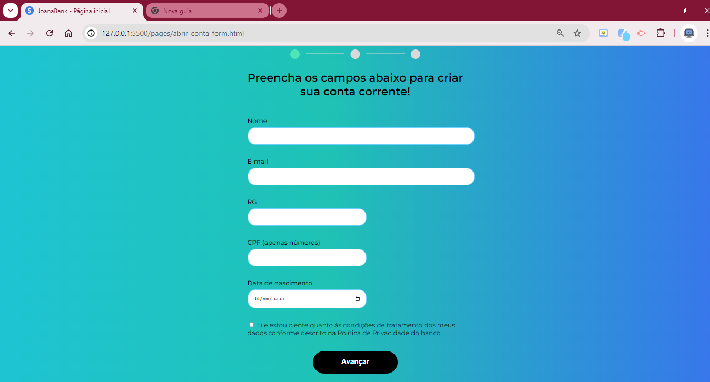
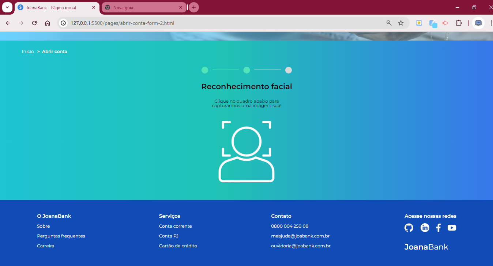
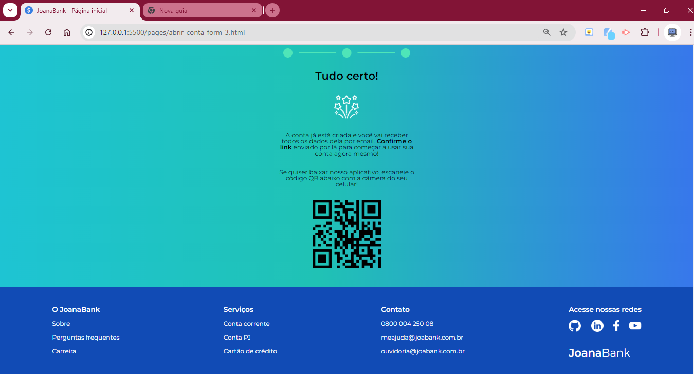

<h1> MoniBank - Alura </h1>

Projeto realizado durante a Formação Front End T6 - ONE Oracle + Alura

JavaScript: validando formulários

Ministrado pela instrutora @MonicaHillman

Durante o curso pude aprofundar meus conhecimentos sobre criação de formulários com javascript, desenvolvendo um Formulário de criação de contas para o banco virtual MoniBank (ou na minha versão JoanaBank 😆)

Aprendi a aplicar atributos de validação de formulário com HTML5, construir validações para os dígitos verificadores do CPF e implementar validações de maioridade através da comparação de datas. 

Além disso, aprendi a customizar mensagens de erro para cada tipo de campo do formulário, integrar a webcam do usuário em uma tela do navegador, capturar fotos via webcam e salvar e editar dados salvos no navegador.

Mas como sempre a parte mais divertida foi mexer no css e deixar o projeto do meu jeitinho 🎨 

Deploy: https://joanatav.github.io/JoanaBank-alura/ 

<h2>Preview 👀 </h2>

<h2>⚙️Tecnologias Utilizadas</h2>

